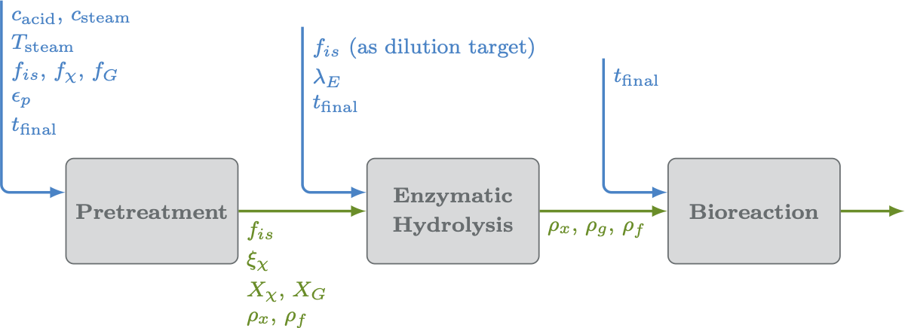

---
jupyter:
  jupytext:
    formats: ipynb,md
    text_representation:
      extension: .md
      format_name: markdown
      format_version: '1.3'
      jupytext_version: 1.16.3
  kernelspec:
    display_name: Python 3 (ipykernel)
    language: python
    name: python3
---

---

# Virtual Engineering

The first step is to select "Cell" > "Run All" from the toolbar.  This will initialize all the widgets and allow you to interact with the unit operation options via the GUI controls.



```python
from ipywidgets import *
from IPython.display import HTML, clear_output
# import os
# import numpy as np

from virteng.WidgetFunctions import WidgetCollection
from virteng.Utilities import get_host_computer
from Models_classes import make_models_list
#================================================================
# See if we're running on HPC or on a laptop
hpc_run = get_host_computer()
#================================================================
```

<!-- #region -->
---

## Set Virtual Engineering Options


### 0. Feedstock properties

Set the feedstock properties.

<!-- #endregion -->

```python
#================================================================
# Create the collection of widgets for feedstock options
fs_options = WidgetCollection()

fs_options.xylan_solid_fraction = widgets.BoundedFloatText(
    value = 0.263,
    max = 1,
    min = 0,
    description = r'Initial $X_X$',
    tooltip = 'The initial fraction of solids that is xylan (kg/kg).  Must be in the range [0, 1]'
)

fs_options.glucan_solid_fraction = widgets.BoundedFloatText(
    value = 0.40,
    max = 1,
    min = 0,
    description = r'Initial $X_G$',
    tooltip = 'The initial fraction of solids that is glucan (kg/kg).  Must be in the range [0, 1]'
)

fs_options.initial_porosity = widgets.BoundedFloatText(
    value = 0.8,
    max = 1,
    min = 0,
    description = r'Initial Porosity',
    tooltip = 'The initial porous fraction of the biomass particles.  Must be in the range [0, 1]'
)

#================================================================
# Display the widgets
fs_options.display_all_widgets()
#================================================================
```

---

### 1. Pretreatment Operation

Set the options for the pretreatment operation below.

```python
#================================================================
# Create the collection of widgets for pretreatment options
pt_options = WidgetCollection()

#### this needs to be changed to g acid / g bone-dry biomass (then converted in the run function) ####
pt_options.initial_acid_conc = widgets.BoundedFloatText(
    value = 0.0001,
    max = 1.0,
    min = 0.0,
    description = 'Acid Loading',
    tooltip = 'The initial concentration of acid (mol/mL).  Must be in the range [0, 1]'
)

pt_options.steam_temperature = widgets.BoundedFloatText(
    value = 150.0,
    max = 250.3,
    min = 3.8,
    description = 'Steam Temperature',
    tooltip = r'The fixed temperature of the steam ($^\circ$C).',
)

pt_options.initial_solid_fraction = widgets.BoundedFloatText(
    value = 0.745,
    max = 1,
    min = 0,
    description = r'Initial FIS$_0$',
    tooltip = 'The initial fraction of insoluble solids (kg/kg).  Must be in the range [0, 1]'
)

pt_options.final_time = widgets.BoundedFloatText(
    value = 8.3,
    max = 1440,
    min = 1,
    description = 'Final Time',
    tooltip = r'Total simulation time (min).  Must be $\geq$ 1'
)

pt_options.show_plots = widgets.Checkbox(
    value = False,
    tooltip = 'Show Plots'
)

#================================================================
# Display the widgets
pt_options.display_all_widgets()
#================================================================
```

---

### 2. Enzymatic Hydrolysis Operation

Set the options for the enzymatic hydrolysis operation using either a two-phase reaction rate model or high-fidelity CFD below.


```python
#================================================================
# Create the collection of widgets
eh_options = WidgetCollection()

eh_options.model_type = widgets.RadioButtons(
    options = ['Lignocellulose Model', 'CFD Surrogate', 'CFD Simulation'],
    value = 'CFD Surrogate',
    description = 'Model Type',
    disabled = False,
    tooltip = 'Specifies the solver to use for the EH step, "CFD Simulation" requires HPC resources.'
)

eh_options.lambda_e = widgets.BoundedFloatText(
    value = 30.0,
    max = 1000.0,
    min = 0.0,
    description = 'Enzymatic Load',
    tooltip = 'Ratio of the enzyme mass to the total solution mass (mg/g).  Must be in the range [0, 1000]'
)

eh_options.fis_0 = widgets.BoundedFloatText(
    value = 0.05,
    max = 1.0,
    min = 0.0,
    description = r'FIS$_0$ Target',
    tooltip = 'The target value for initial fraction of insoluble solids *after* dilution (kg/kg).  Must be in the range [0, 1]'
)

eh_options.t_final = widgets.BoundedFloatText(
    value = 24.0,
    min = 1.0,
    max = 24.0,
    description = 'Final Time',
    tooltip = r'The total time of the simulation (h).  Must be $\geq$ 1'
)

eh_options.show_plots = widgets.Checkbox(
    value = False,
    tooltip = 'Show Plots',
    disabled = True,
)

#================================================================
# Display the widgets
eh_options.display_all_widgets()
#================================================================

def model_type_action(change):
        
    if eh_options.model_type.value == 'Lignocellulose Model':
        # Lignocellulose Model
        eh_options.show_plots.value = False
        eh_options.show_plots.disabled = False
        eh_options.show_plots.description_tooltip = 'Show Plots'

    else:
        # Surrogate Model, CFD Simulation
        eh_options.show_plots.value = False
        eh_options.show_plots.disabled = True
        eh_options.show_plots.description_tooltip = 'Show Plots (Only available for lignocellulose model)'

eh_options.model_type.observe(model_type_action, names='value')
```

---

### 3. Bioreaction Operation

Set the options for the bubble column bioreaction operation below.


```python
#================================================================
# Create the collection of widgets
br_options = WidgetCollection()

br_options.model_type = widgets.RadioButtons(
    options = ['CFD Surrogate', 'CFD Simulation'],
    value = 'CFD Surrogate',
    description = 'Model Type',
    disabled = False,
    tooltip = 'Specifies the solver to use for the bioreaction step, "CFD Simulation" requires HPC resources.'
)

br_options.gas_velocity = widgets.BoundedFloatText(
    value = 0.08, 
    min = 0.01,
    max = 0.1,
    description = 'Gas velocity',
    tooltip = r'Gas velocity in the simulation (m/s).  Must be in $[0.01, 0.1]$'
)

br_options.column_height = widgets.BoundedFloatText(
    value = 40., 
    min = 10.,
    max = 50.,
    description = 'Column height',
    tooltip = r'Column height (m).  Must be in $[10, 50]$'
)

br_options.column_diameter = widgets.BoundedFloatText(
    value = 5.0, 
    min = 1.,
    max = 6.,
    description = 'Column diameter',
    tooltip = r'Column diameter (m).  Must be in $[1, 6]$'
)

br_options.bubble_diameter = widgets.BoundedFloatText(
    value = 0.006,
    min = 0.003,
    max = 0.008,
    description = 'Bubble diameter',
    tooltip = r'Bubble diameter (m).  For surragate model must be in $[0.003, 0.008]$, for cfd must be $>=0$'
)

br_options.t_final = widgets.BoundedFloatText(
    value = 100.0, # default 500
    min = 1.0,
    max = 1e16,
    description = 'Final Time',
    tooltip = r'The total time of the simulation (h).  Must be $\geq 1$'
)

#================================================================
# Display the widgets
br_options.display_all_widgets()
#================================================================
```

---

## Run Model

When finished setting options for all unit operations, press the button below to run the complete model.


```python
#================================================================
run_button = widgets.Button(
    description = 'Run All.',
    tooltip = 'Execute the model start-to-finish with the properties specified above.',
    layout =  {'width': '200px', 'margin': '25px 0px 100px 170px'}, 
    button_style = 'success'
)
#================================================================

# run_button_output = widgets.Output()
display(run_button)

#================================================================
# Define a function to be executed each time the run button is pressed
def run_button_action(b):
    clear_output()
    display(run_button)
    verbose = True
    # Initialize models
    models_list = make_models_list([fs_options, pt_options, eh_options, br_options], n_models=4, hpc_run=hpc_run)
    for model in models_list:
        model.run(verbose=verbose)
    
run_button.on_click(run_button_action)
#================================================================
```

---

```python
a = HTML('''<script>
code_show=true; 
function code_toggle() {
 if (code_show){
 $('div.input').hide();
 } else {
 $('div.input').show();
 }
 code_show = !code_show
} 
$( document ).ready(code_toggle);
</script>
<form action="javascript:code_toggle()"><input type="submit" \
value="Toggle code visibility (hidden by default)."></form>''')

display(a)
```
