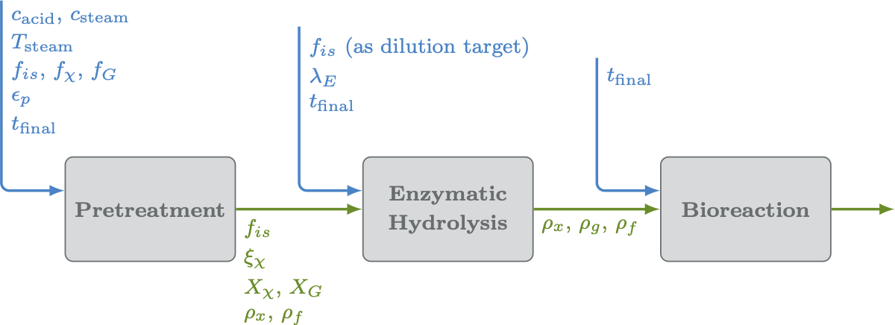

Applications: Bioconversion
===========================

The numerical simulation of real-world systems frequently requires linking multiple models together---potentially spanning multiple levels of physical 
fidelity and computational resources---such that the outputs of one model can inform the inputs of another. 
Virtual Engineering (VE) is a Python package that enables the creation of this type of model sequence. 
It was originally developed to support the simulation and optimization of the low-temperature conversion of biomass to fuel 
which is typically performed as a three-step process.

These three separately developed computational unit operations of bioconvertion are: 

* the **pretreatment** of the feedstock to make cellulose more accessible, 
* an **enzymatic hydrolysis** step to digest cellulose into sugars, and 
* a **bioconversion** step  to convert sugars into products in a reactor. 

.. toctree::
   :maxdepth: 1

   background
   notebooks/WidgetsNotebook
   notebooks/OptimizationNotebook
