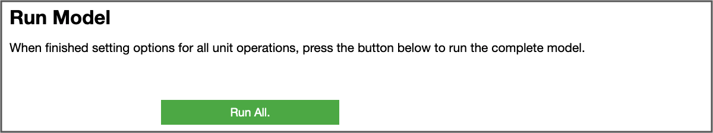

Getting Started
===============

Building Conda Environment
--------------------------

This Virtual Engineering repository contains all the tools needed to create Jupyter Notebooks to control the execution of various unit operations for the beginning-to-end simulation (as example application we use the low-temperature conversion of lignocellulosic biomass to a fuel precursor).  The first step is to create a Conda environment using the included ``environment.yaml`` file. To create this environment, simply open a terminal, navigate to the root level of the Virtual Engineering directory and run::

	conda env create -f environment.yaml -n <env_name>

where ``<env_name>`` should be replaced with the name you'd like to use for your Conda environment. This builds a Conda environment using the packages enumerated in the yaml file and pip installs the ``virteng`` Python package which adds functionality required by the Jupyter Notebook workflow.  Once the Conda environment is successfully created, activate it from the command line with::

	conda activate <env_name>

then, launch the Notebook by running::

	jupyter notebook

When the Notebook landing page opens, you'll be able to navigate to ``applications/Bioconversion`` folder and open the ``virtual_engineering_notebook.ipynb`` which will allow you to launch simulations and move on to the next step.

Running Notebook
----------------

One of the best features of Jupyter Notebooks is the ability to blend written explanations using markdown syntax with high-performance code.  These markdown blocks serve to illustrate what different input values control and how the user is expected to interact with them, but the overall flow is briefly explained here for completeness.

The VE Notebooks use `ipwidgets` to solicit user input for key parameters in the conversion process.  The collection of widgets for controlling the enzymatic hydrolysis unit process is shown below

.. figure:: figures/eh_widgets.png
  :align: center

  The EH widgets as seen in the Notebook interface.

where the user is asked to specify the type of model to use and key control variables.  All fields are pre-populated with model types that don't require high performance computing (HPC) hardware and physically reasonable values.  In cases where an upper or lower bound on an input exists, the widgets will allow only valid entries, e.g., numerical values falling in the range :math:`[0.0, 1.0]`.  In certain cases, choosing a Notebook option will alter the available input options.  For example, selecting "Lignocellulose Model" as the model type will enable the "Show Plots" button (disabled otherwise) since these plots can only be displayed when using this model.  Once all the user inputs have been defined, the beginning-to-end simulation can be run by pressing the "Run All" button.

  The EH widgets as seen in the Notebook interface.

Printed outputs and plots (if applicable) will be shown in the space directly below this button within the Notebook.  Changing the widget values does not automatically re-calculate or update these outputs; the "Run All" button must be pressed to clear the current output and execute the simulation under the new operating parameters.