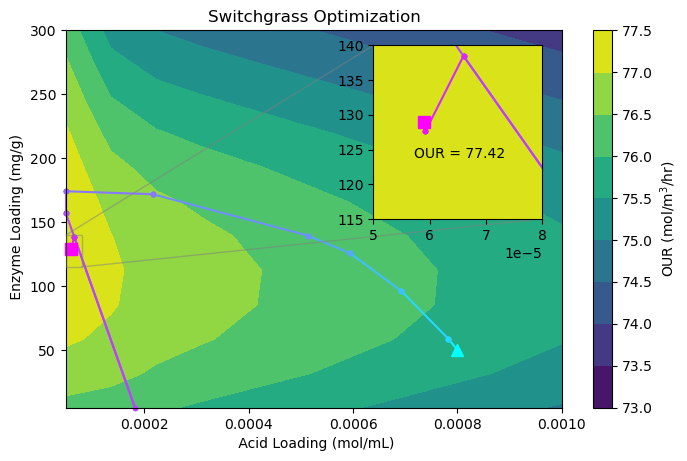

# Summary

`Virtual Engineering` (`VE`) is a Python software framework designed to accelerate research and development of engineering processes. It supports multi-physics models of unit operations and joins them to simulate the entire end-to-end process. To automate the execution of this model sequence, `VE` provides (i) a robust method to communicate between models, (ii) a high-level user-friendly interface to set model parameters and enable optimization, and (iii) an overall model-agnostic approach that allows new computational units to be swapped in and out of workflows. Although the `VE` approach was developed to support a process of low-temperature conversion of biomass to fuel, we have designed each component to easily accommodate new domains and unit models.

# Statement of need

Many industrial and manufacturing operations are comprised of a discrete sequence of processing steps that each treat, refine, or otherwise act on some bulk material towards producing a final product. Process optimization can depend on a variety of factors, such as the operating parameters for each step as well as the overall selection and order of the processing steps. Numerical simulations that can support the analysis of such systems frequently require linking multiple individual models together---each associated with different steps in the overall operational process---such that the outputs of one model can inform the inputs of the next. These models can potentially span multiple levels of physical fidelity and computational costs. Virtual Engineering (`VE`) is a Python package that enables the creation of this type of model sequence. 

`VE` was originally developed to support the simulation and optimization of the low-temperature conversion of biomass to fuel which is typically performed as a three-step process (Figure \ref{fig:VE_diagram}). These three separately developed computational unit operations of bioconvertion are:  (i) the _pretreatment_ of the feedstock to make cellulose more accessible [@sitaraman_multiphysics_2015], (ii) an _enzymatic hydrolysis_ step to digest cellulose into sugars [@sitaraman_coupled_2019], and (iii) a _bioconversion_ step to convert sugars into products in a reactor [@rahimi_computational_2018]. Finally, the value of these products and the capital and operating costs associated with generating them are estimated using calculations derived from Aspen Plus techno-economic analysis (TEA) software [@aspen2022]. 

The models representing these steps vary from one-dimensional finite element models that can be carried out on a modern laptop in seconds to three-dimensional computational fluid dynamics (CFD) simulations that require high-performance computing (HPC) resources and hours of CPU time. Maintaining a continuous simulation between different operating systems and hardware across potentially days of wallclock time is not well supported with existing workflows. The `VE` package offers an interface with the SLURM job scheduler [@yoo_slurm_2003] and modifies and launches OpenFOAM jobs [@weller_1998] to automate the end-to-end bioconversion process. Although this set of functions was necessary to support the original use case of the bioconversion process, the underlying programming interface and object-oriented model wrappers were designed to be as model-agnostic as possible.

{ width=100% }

To enable users to easily set up and launch new simulations, either by swapping in alternate computational models or specifying a different set of prescribed input parameters, the `VE` package uses `Jupyter` notebooks [@kluyver2016jupyter] for their ability to deploy both GUI elements and performant code on different hardware and operating systems. The GUI elements comprise groups of `ipywidgets` [@interactive_Jupyter_widgets] that offer easy methods to solicit and error-check user-input values (see Figure \ref{fig:controls}). Additionally, this notebook interface enables users to specify either a once-through simulation problem (Figure \ref{fig:run}) or an iterative optimization in which the controls and bounds can be easily set via widgets. This combination of features, along with the unique methods developed to support our specific use cases, distinguishes `VE` from other workflow solutions like Airflow[^1], Luigi[^2], or Dagster[^3].

{ width=100% }

{ width=100% }

[^1]:  [airflow.apache.org](https://airflow.apache.org/)
[^2]:  [github.com/spotify/luigi](https://github.com/spotify/luigi)
[^3]:  [dagster.io](https://dagster.io/)

# Example of bioconvertion optimization

The `VE` package provides an optimization capability that can be easily accessed through the user-friendly `ipywidgets` GUI interface. The notebook supports the selection of multiple control variables, in which case all chosen variables will be tuned to minimize a given objective function over a multidimensional design space. Additionally, users can choose to minimize either the final output or any intermediate output of the process. In the latter case, the number of unit models in the process is automatically adjusted based on a specified objective.

To demonstrate these capabilities of the `VE` package, we optimize the oxygen uptake rate (OUR) in the bioconversion process (Figure \ref{fig:VE_diagram}) by solving the box-constrained optimization problem with two controls summarized in Table \ref{tab:opt_problem}. It is important to note that the objective function, OUR, is an output of the bioreactor (BR) model, while acid loading and enzyme loading are independent inputs to the pretreatment (PT) and enzymatic hydrolysis (EH) models, respectively. 

: Optimization problem with objective and control variables in different unit operations.\label{tab:opt_problem}

|            |                 | Lower bound| Upper bound| Units |
|:--------|:-------------------|:--------:|:--------:|:------:|
| Maximize:  | OUR (BR output) |             |             |       |
| By Varying:|Acid Loading (PT input)| $5\times10^{-5}$ |$1\times10^{-3}$|mol/mL|
|            |Enzyme Loading (EH input)| 5          | $300$       |    mg/g|

We solve this optimization problem for two different modeled feedstocks: switchgrass and corn stover. The key distinction between them is the amount of xylan, glucan, and lignin present in the initialization of the pretreatment model (Table \ref{tab:feedstock}). 

: Feedstock parameters for two optimization cases adopted from [@Ragauskas2014]\label{tab:feedstock}.

|Feedstock  | Xylan (kg/kg) |Glucan (kg/kg) | Lignin (kg/kg)|
|:----------|:-------------:|:-------------:|:-------------:|
|Switchgrass| 0.325         | 0.463         |0.213          |
|Corn Stover| 0.360         | 0.430         | 0.209         | 

To accelerate the optimization process, we developed surrogate models for computationally expensive unit operations of EH and BR, utilizing Gaussian process regression and leveraging dimension reduction and active importance sampling. As a result, one can obtain predictions of EH and BR outputs within seconds.

Figure \ref{fig:opt_results} illustrates the optimization process for these two different feedstocks. The contour plot of OUR is obtained by sweeping through parameter space and serves as the background to visualize the behavior of the objective function. This contour plot verifies that our optimization algorithm follows the gradients as expected and converges to a reasonable final solution. 

To demonstrate the robustness of the optimization algorithm, we used different initial values for the control variables in the switchgrass and corn stover cases. Table \ref{tab:opt_results} displays the initial and final values of the controls and the objective, as well as the change in the OUR.

: Optimization results\label{tab:opt_results}

|Feedstock     | Initial \ Acid  | Initial Enzyme| Initial OUR   | $~$Final$~$ $~$Acid$~$  | Final Enzyme| Final OUR   |OUR Change|
|:-------------|:---------:|:-------:|:------:|:-----------:|:-------:|:------:|:-------:|
|Switchgrass| $8\times 10^{-4}$ | 50.00 | 75.76 | $5.89\times 10^{-5}$ | 128.90 | 77.42 | +2.19\% |
|Corn Stover| $8\times 10^{-4}$ | 250.00| 74.06 | $6.17\times 10^{-5}$ | 139.28 | 76.83 | +3.73\% |

<!-- It should be noted that the percent change value reported in the final column is an improvement over a randomly-selected initial guess only as opposed to an improvement over some more realistic set of operating conditions. However, it does serve to illustrate the direction of change as a sanity check that the optimization algorithm moves in the correct direction and highlight the magnitude of the change that is achievable when moving through a two-dimensional region of a much larger control space.  -->

One interesting outcome is the contrast in the optimal amount of enzyme loading between the two feedstocks, where corn stover is optimally processed with an enzyme loading $\sim 8\%$ greater than that for switchgrass (139.28 vs 128.90 mg/g). This significant change between the two feedstocks emphasizes the value of the `VE` framework for enabling optimization studies over a wide variety of user-specified conditions and constraints.

<!--  -->

# VE usage in the research

[**ADD citations to the public bioconvertion results**]

Finally, we reiterate that, while developed for the specific biomass conversion process discussed above, the `VE` framework is comprised of generalizable components that can readily extend to model a wide array of industrial and manufacturing workflows. As an example, we may consider the processing of iron ore for steelmaking. This industrial process generally includes multiple stages of grinding, separation, treatment, and some form of pelletizing. Each of the processes can be performed in different ways---e.g., grinding may be performed with bar or ball grinders or using high-pressure grinding rollers that all have different pros and cons as well as different operational parameters. The `VE` framework could be used to study different grinding methods within the context of a broader iron ore processing operation to see optimize different objectives, such as yield, cost, or energy usage. Similar design process questions can arise in applications such as pharmaceutical production, microelectronics fabrication, agricultural processing, and more.

<!-- # Example of optimizing the design of bioreactor

We used the `VE` framework to carry out 308 CFD simulations of the bioconversion step with randomized combinations of superficial gas velocity, reactor height, reactor diameter, maximum oxygen uptake rate (OUR$_{\text{max}}$), and bubble diameter to probe how different control combinations affect both performance and cost. The relevant units and sampled range of these input parameters are shown in Table 1.

: The names, units, and bounds of the variables defining the parameter space explored in an example `VE` use case  

| Quantities               | Units       | Lower bound | Upper bound |
|-------------------------:|-------------|-------------|-------------|
| Superficial Gas Velocity | m/s         | 0.01        | 0.1         |
| Reactor Height           | m           | 10          | 50          |
| Reactor Diameter         | m           | 1           | 6           |
| OUR$_{\text{max}}$       | mol/m$^3$/h | 5           | 100         |
| Bubble Diameter          | m           | 0.003       | 0.008       |

We then couple the output of these CFD simulations, namely, the oxygen uptake rate, with a TEA analysis to obtain the corresponding price per kilogram of oxygen, \$/kg$_{O_2}$, for every CFD simulation. From this dataset, we produce the plots of \$/kg$_{O_2}$ obtained from TEA as a function of each of our CFD input variables shown in Figure 1.

As shown in Figure 1, there are clear preferences for operating reactors with larger heights and diameters and a less clear preference, for example, with respect to bubble diameter, which shows no clear trend toward large or small values. This intuition is borne out when plotting the sensitivity of \$/kg$_{O_2}$ with respect to each of the input parameters via Sobol indices, as shown in Figure 2.

{ width=75% }

Optimizing this system for various fixed quantities of OUR$_{\text{max}}$ reveals a semi-linear trend in gas velocity, with higher values required for higher OUR$_{\text{max}}$, and re-confirms the original intuition that larger bioconversion reactors, both in height and diameter, are beneficial from a cost-vs-product-value perspective. This analysis is shown in Figure 3.

 -->

# Acknowledgements

This work was authored by the National Renewable Energy Laboratory, operated by Alliance for Sustainable Energy, LLC, for the U.S. Department of Energy (DOE) under Contract No. DE-AC36-08GO28308. Funding provided by U.S. Department of Energy Office of Energy Efficiency and Renewable Energy Bioenergy Technologies Office. The views expressed in the article do not necessarily represent the views of the DOE or the U.S. Government. The U.S. Government retains and the publisher, by accepting the article for publication, acknowledges that the U.S. Government retains a nonexclusive, paid-up, irrevocable, worldwide license to publish or reproduce the published form of this work, or allow others to do so, for U.S. Government purposes. A portion of the research was performed using computational resources sponsored by the Department of Energy's Office of Energy Efficiency and Renewable Energy and located at the National Renewable Energy Laboratory.

# References
