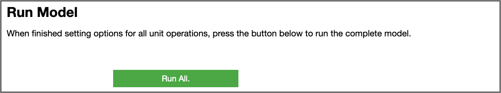

# Summary

`Virtual Engineering` (`VE`) is a Python software framework designed to accelerate the research and development of engineering processes that are fundamentally defined by multiple unit operations executed in series. 
VE supports a wide variety of different multi-physics models and integrates them to simulate a complete end-to-end process. To automate the execution of this model sequence, `VE` provides (i) a robust method to communicate between models, 
(ii) a high-level, user-friendly interface to set model parameters and enable optimization, and (iii) an overall model-agnostic approach that allows new computational units to be swapped in and out of workflows. 
Although the `VE` framework was developed to support the biochemical conversion of biomass to fuel, we have designed each component to easily accommodate new domains and unit models.

# Statement of need

Many industrial and manufacturing operations consist of a sequence of discrete processing steps, including physicochemical transformations, to produce a final product. Often, optimizing the performance of each individual step—such as yield or energy efficiency—does not lead to the overall best outcome. Therefore, it is essential to ensure connectivity between each step and optimize the whole process. This process optimization can depend not only on operating parameters for each step but also on the choice and order of these steps.

Numerical simulations that can support the analysis and optimization of such systems frequently require linking multiple individual models together—each associated with different steps in the overall operational process—so that the outputs of one model can inform the inputs of the next. These models can span multiple levels of physical fidelity and computational costs. `Virtual Engineering` (`VE`) is a Python package that enables the creation of this type of model sequence. 

`VE` was originally developed to support the simulation and optimization of the biochemical conversion of lignocellulosic biomass to fuels. This bioconversion process was modeled by linking previously developed computational models as three important unit operations (Figure \ref{fig:VE_diagram}):  (i) the _pretreatment_ of the feedstock to make cellulose more accessible [@sitaraman_multiphysics_2015], (ii) an _enzymatic hydrolysis_ step to digest lignocellulose into sugars [@sitaraman_coupled_2019;@lischeske2019two], and (iii) a _bioconversion_ step to convert sugars into products in a bioreactor [@rahimi_computational_2018].  Finally, the capital and operating costs of the process, and the product's (in this case, ethanol) subsequent minimum feasible selling price through discounted cash flow analysis, were calculated using an Aspen Plus process simulation with techno-economic analysis (TEA) [@humbird2011process]. 

{ width=100% }

{ width=100% }

{ width=100% }

The models representing these steps vary from one-dimensional finite element models that can be carried out on a modern laptop in seconds to three-dimensional computational fluid dynamics (CFD) simulations that require high-performance computing (HPC) resources and several hours of CPU time. Maintaining a continuous simulation between different operating systems and hardware across potentially long wallclock times (often more than 24 hours) is not well supported with existing workflows. The `VE` package offers an interface with the SLURM job scheduler [@yoo_slurm_2003] and modifies and launches OpenFOAM jobs [@weller_1998] to automate the end-to-end bioconversion process. Although this set of functions was necessary to support the original use case of the bioconversion process, the underlying programming interface and object-oriented model wrappers were designed to be as model-agnostic as possible.

To enable users to easily set up and launch new simulations, either by swapping in alternate computational models or specifying a different set of prescribed input parameters, the `VE` package uses `Jupyter` notebooks [@kluyver2016jupyter] for their ability to deploy both GUI elements and performant code on different hardware and operating systems. The GUI elements comprise groups of `ipywidgets` [@interactive_Jupyter_widgets] that offer easy methods to solicit and error-check user-input values (see Figure \ref{fig:controls}). Additionally, this notebook interface enables users to specify either a once-through simulation problem (Figure \ref{fig:run}) or an iterative optimization in which the controls and bounds can be easily set via widgets. This combination of features, along with the unique methods developed to support our specific use cases, distinguishes `VE` from other workflow solutions like Airflow[^1], Luigi[^2], or Dagster[^3].

[^1]:  [airflow.apache.org](https://airflow.apache.org/)
[^2]:  [github.com/spotify/luigi](https://github.com/spotify/luigi)
[^3]:  [dagster.io](https://dagster.io/)

# Example of bioconversion optimization

The `VE` package provides an optimization capability that can be easily accessed through the user-friendly `ipywidgets` GUI interface. The notebook supports the selection of multiple control variables, in which case all chosen variables will be tuned to minimize a given objective function over a multidimensional design space. Additionally, users can choose to minimize either the final output or any intermediate output of the process. In the latter case, the number of unit models in the process is automatically adjusted based on the specified objective; for example, executing only the first element in a three-element series if the objective function depends only on element one.

To demonstrate these capabilities of the `VE` package, we optimize the oxygen uptake rate (OUR) that determines fuel yields in the bioconversion process (Figure \ref{fig:VE_diagram}), by solving the box-constrained optimization problem with two controls summarized in Table \ref{tab:opt_problem}. It is important to note that the objective function, OUR, is an output of the bioreactor (BR) model, while acid loading and enzyme loading are independent inputs to the pretreatment (PT) and enzymatic hydrolysis (EH) models, respectively, which indirectly affect overall fuel yields. 

: Optimization problem with objective and control variables in different unit operations.\label{tab:opt_problem}

|            |                 | Lower bound| Upper bound| Units |
|:--------|:-------------------|:--------:|:--------:|:------:|
| Maximize:  | OUR (BR output) |             |             |       |
| By Varying:|Acid Loading (PT input)| $5\times10^{-5}$ |$1\times10^{-3}$|mol/mL|
|            |Enzyme Loading (EH input)| 5          | $300$       |    mg/g|

We solve this optimization problem for two different modeled feedstocks: switchgrass and corn stover. The key distinction between them is the amount of cellulose (glucan), hemicellulose (xylan), and lignin present in the initialization of the pretreatment model (Table \ref{tab:feedstock}). 

: Feedstock parameters for two optimization cases adopted from [@Ragauskas2014]\label{tab:feedstock}.

|Feedstock  | Xylan (kg/kg) |Glucan (kg/kg) | Lignin (kg/kg)|
|:----------|:-------------:|:-------------:|:-------------:|
|Switchgrass| 0.325         | 0.463         |0.213          |
|Corn Stover| 0.360         | 0.430         | 0.209         | 

To accelerate the optimization process, we developed surrogate models for the computationally expensive unit operations of EH and BR, utilizing Gaussian process regression and leveraging dimension reduction and active importance sampling. As a result, one can obtain predictions of EH and BR outputs within seconds.

Figure \ref{fig:opt_results} illustrates the optimization process for these two different feedstocks. The contour plots of OUR are obtained by sweeping through the parameter space and serve as the background to visualize the behavior of the objective function. These contour plots verify that our optimization algorithm follows the gradients as expected and converges to a reasonable final solution.

To demonstrate the robustness of the optimization algorithm, we used different initial values for the control variables in the switchgrass and corn stover cases. Table \ref{tab:opt_results} displays the initial and final values of the controls, the objective, and the change in the OUR.

{ width=93% }

{ width=93% }

: Optimization results\label{tab:opt_results}

|Feedstock     | Initial \ Acid  | Initial Enzyme| Initial OUR   | $~$Final$~$ $~$Acid$~$  | Final Enzyme| Final OUR   |OUR Change|
|:-------------|:---------:|:-------:|:------:|:-----------:|:-------:|:------:|:-------:|
|Switchgrass| $8\times 10^{-4}$ | 50.00 | 75.76 | $5.89\times 10^{-5}$ | 128.90 | 77.42 | +2.19\% |
|Corn Stover| $8\times 10^{-4}$ | 250.00| 74.06 | $6.17\times 10^{-5}$ | 139.28 | 76.83 | +3.73\% |

One interesting outcome is the difference in the optimal amount of enzyme loading between the two feedstocks, where corn stover is optimally processed with an enzyme loading $\sim 8\%$ greater than that for switchgrass (139.28 vs 128.90 mg/g). Additionally, while a higher acid loading could improve pretreatment conversion, it is not the optimal for the overall process because it produces more byproducts that can negatively affect bioreaction. This emphasizes the value of the `VE` framework for easily enabling multi-model optimization studies over a wide variety of user-specified conditions and constraints.

# VE usage in the research

The `VE` package was used to quantify the effects of modifying the enzyme loading and total enzymatic hydrolysis processing time on the minimum fuel selling price and the optimization features were used to identify the porosity of the initial feedstock necessary to maximize the OUR. These results, plus a live demonstration of the `VE` notebook usage, were presented at the 2021 American Institute of Chemical Engineers (AIChE) Annual Meeting [@young_aiche_2021]. A more comprehensive analysis---including details on the surrogate modeling methodology, model validation against experimental results, and multi-variable optimization outcomes to maximize OUR---was presented at the 2023 Bioenergy Technologies Office (BETO) peer review [@young_beto_2023].

Finally, we reiterate that, while developed for the specific biomass conversion process discussed above, the `VE` framework is comprised of generalizable components that can readily extend to model a wide array of industrial and manufacturing workflows. An immediate example for future extension is on thermochemical conversion pathways such as biomass/plastics/solid-waste pyrolysis or gasification that involves similar chemically reacting flows except in a gas-solid environment. `VE` framework also provides a pathway to combine biochemical and thermochemical approaches and identify overall optimal process conditions, in line with current research directions on hybrid integrated approaches [@begum2024review]. 

As another example, we may consider the processing of iron ore for steelmaking. This industrial process generally includes multiple stages of grinding, separation, treatment, and some form of pelletizing. Each of the processes can be performed in different ways---e.g., grinding may be performed with bar or ball grinders or using high-pressure grinding rollers that all have different pros and cons as well as different operational parameters. The `VE` framework could be used to study different grinding methods within the context of a broader iron ore processing operation to optimize different objectives, such as yield, cost, or energy usage. Similar design process questions can arise in applications such as pharmaceutical production, microelectronics fabrication, agricultural processing, and more.

# Acknowledgements

This work was authored by the National Renewable Energy Laboratory, operated by Alliance for Sustainable Energy, LLC, for the U.S. Department of Energy (DOE) under Contract No. DE-AC36-08GO28308. Funding provided by U.S. Department of Energy Office of Energy Efficiency and Renewable Energy Bioenergy Technologies Office. The views expressed in the article do not necessarily represent the views of the DOE or the U.S. Government. The U.S. Government retains and the publisher, by accepting the article for publication, acknowledges that the U.S. Government retains a nonexclusive, paid-up, irrevocable, worldwide license to publish or reproduce the published form of this work, or allow others to do so, for U.S. Government purposes. A portion of the research was performed using computational resources sponsored by the Department of Energy's Office of Energy Efficiency and Renewable Energy and located at the National Renewable Energy Laboratory.

# References
