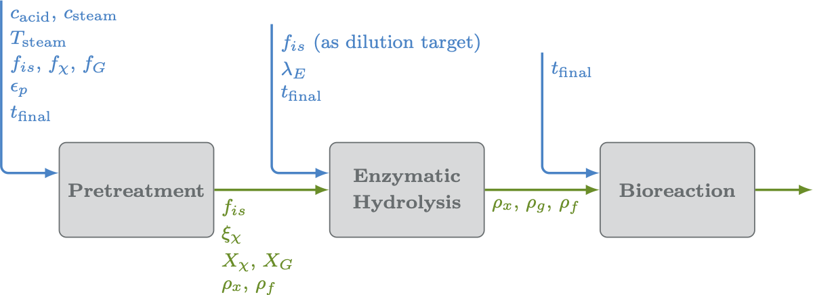

---
jupyter:
  jupytext:
    formats: ipynb,md
    text_representation:
      extension: .md
      format_name: markdown
      format_version: '1.2'
      jupytext_version: 1.4.0
  kernelspec:
    display_name: Python 3
    language: python
    name: python3
---

---

# Virtual Engineering

The first step is to select "Cell" > "Run All" from the toolbar.  This will initialize all the widgets and allow you to interact with the unit operation options via the GUI controls.




```python
%reset -f
from ipywidgets import *
from IPython.display import HTML, clear_output
import os

import vebio.WidgetFunctions as wf
from vebio.FileModifiers import write_file_with_replacements
from vebio.Utilities import get_host_computer, yaml_to_dict, dict_to_yaml

#================================================================

# See if we're running on Eagle or on a laptop
hpc_run = get_host_computer()

#================================================================

```

<!-- #region -->
---

## Set Virtual Engineering Options


### 0. Feedstock properties

Set the feedstock properties.

<!-- #endregion -->

```python
#================================================================

# Create the collection of widgets
fs_options = wf.WidgetCollection()

fs_options.xylan_solid_fraction = widgets.BoundedFloatText(
    value = 0.263,
    max = 1,
    min = 0,
    description = r'Initial $X_X$',
    description_tooltip = 'The initial fraction of solids that is xylan (kg/kg).  Must be in the range [0, 1]'
)

fs_options.glucan_solid_fraction = widgets.BoundedFloatText(
    value = 0.40,
    max = 1,
    min = 0,
    description = r'Initial $X_G$',
    description_tooltip = 'The initial fraction of solids that is glucan (kg/kg).  Must be in the range [0, 1]'
)

fs_options.initial_porosity = widgets.BoundedFloatText(
    value = 0.8,
    max = 1,
    min = 0,
    description = r'initial porosity',
    description_tooltip = 'The initial forous fraction of the biomass particles.  Must be in the range [0, 1]'
)


#================================================================

# Display the widgets
fs_options.display_all_widgets()

#================================================================

```

---

### 1. Pretreatment Operation

Set the options for the pretreatment operation below.

```python
#================================================================

# Create the collection of widgets
pt_options = wf.WidgetCollection()

pt_options.initial_acid_conc = widgets.BoundedFloatText(
    value = 0.0001,
    max = 1.0,
    min = 0.0,
    description = 'Acid Loading',
    description_tooltip = 'The initial concentration of acid (g/g).  Must be in the range [0, 1]'
)

pt_options.steam_temperature = widgets.BoundedFloatText(
    value = 423,
    max = 1000,
    min = 100,
    description = 'Steam Temperature',
    description_tooltip = r'The fixed temperature of the steam (K).'
)

pt_options.bulk_steam_conc = widgets.BoundedFloatText(
    value = 0.0001,
    max = 1.0,
    min = 0.0,
    description = 'Bulk Steam Concentration',
    description_tooltip = 'The ambient steam concentration.  Must be in the range [0, 1]'
)

pt_options.initial_solid_fraction = widgets.BoundedFloatText(
    value = 0.745,
    max = 1,
    min = 0,
    description = r'Initial FIS$_0$',
    description_tooltip = 'The initial fraction of insoluble solids (kg/kg).  Must be in the range [0, 1]'
)

pt_options.final_time = widgets.BoundedFloatText(
    value = 100, #2400
    max = 1e16,
    min = 1,
    description = 'Final Time',
    description_tooltip = r'Total simulation time (s).  Must be $\geq$ 1'
)

pt_options.show_plots = widgets.Checkbox(
    value = False,
    description_tooltip = 'Show Plots'
)


#================================================================

# Display the widgets
pt_options.display_all_widgets()

#================================================================

```

---

### 2. Enzymatic Hydrolysis Operation

Set the options for the enzymatic hydrolysis operation using a two-phase reaction rate model below.


```python
#================================================================

# Create the collection of widgets
eh_options = wf.WidgetCollection()

eh_options.lambda_e = widgets.BoundedFloatText(
    value = 0.03,
    max = 1.0,
    min = 0.0,
    description = 'Enzymatic Load',
    description_tooltip = 'Ratio of the enzyme mass to the total solution mass (kg/kg).  Must be in the range [0, 1]'
)

eh_options.fis_0 = widgets.BoundedFloatText(
    value = 0.05,
    max = 1.0,
    min = 0.0,
    description = r'FIS$_0$ Target',
    description_tooltip = 'The target value for initial fraction of insoluble solids *after* dilution (kg/kg).  Must be in the range [0, 1]'
)

eh_options.t_final = widgets.BoundedFloatText(
    value = 100.0,
    min = 1.0,
    max = 1e16,
    description = 'Final Time',
    description_tooltip = r'The total time of the simulation (h).  Must be $\geq$ 1'
)

eh_options.show_plots = widgets.Checkbox(
    value = False,
    description_tooltip = 'Show Plots'
)

eh_options.use_cfd = widgets.Checkbox(
    value = False,
    description_tooltip = 'Use High-Fidelity CFD (Requires HPC Resources)',
)

#================================================================

# Display the widgets
eh_options.display_all_widgets()

#================================================================

def use_cfd_action(b):
    if eh_options.use_cfd.value:
        eh_options.show_plots.value = False
        eh_options.show_plots.disabled = True
        eh_options.show_plots.description_tooltip = 'Show Plots (Not available for CFD operation)'
    else:
        eh_options.show_plots.value = False
        eh_options.show_plots.disabled = False
        eh_options.show_plots.description_tooltip = 'Show Plots'


eh_options.use_cfd.observe(use_cfd_action)
```

---

### 3. Bioreaction Operation

Set the options for the bubble column bioreaction operation below.


```python
#================================================================

# Create the collection of widgets
br_options = wf.WidgetCollection()

br_options.t_final = widgets.BoundedFloatText(
    value = 100.0,
    min = 1.0,
    max = 1e16,
    description = 'Final Time',
    description_tooltip = r'The total time of the simulation (h).  Must be $\geq 1$'
                                    # is this really 'h'? current quasi-steady simulations only run 10s of seconds
)

#================================================================

# Display the widgets
br_options.display_all_widgets()

#================================================================

```

---

## Run Model

When finished setting options for all unit operations, press the button below to run the complete model.


```python
def run_pretreatment(root_dir, params_filename):
    print('Running Pretreatment Model')
    
    # Export the feedstock and pretreatment options to a global yaml file
    fs_dict = fs_options.export_widgets_to_dict('feedstock')
    pt_dict = pt_options.export_widgets_to_dict('pretreatment_input')
    dict_to_yaml([fs_dict, pt_dict], params_filename)

    # Move into the pretreatment directory
    os.chdir('pretreatment_model/test/')
    
    # Run pretreatment code specifying location of input file
    path_to_input_file = '%s/%s' % (root_dir, params_filename)
    %run ptrun.py $path_to_input_file
    
    if pt_options.show_plots.value:
        %run postprocess.py 'out_\*.dat' exptdata_150C_1acid.dat

    os.chdir(root_dir)
    print('\nFinished Pretreatment')

    
def run_enzymatic_hydrolysis(root_dir, params_filename):
    print('\nRunning Enzymatic Hydrolysis Model')

    # Export the enzymatic hydrolysis options to a global yaml file
    eh_dict = eh_options.export_widgets_to_dict('enzymatic_input')
    dict_to_yaml(eh_dict, params_filename, merge_with_existing=True)
    
    # Run the selected enzymatic hydrolysis model
    if eh_options.use_cfd.value:
        
        # Export the current state to a dictionary
        ve_params = yaml_to_dict(params_filename)
                
        # Prepare input values for EH CFD operation
        dilution_factor = ve_params['enzymatic_input']['fis_0']/ve_params['pretreatment_output']['fis_0']
        rho_x0 = ve_params['pretreatment_output']['rho_x']*dilution_factor
        rho_f0 = ve_params['pretreatment_output']['rho_f']*dilution_factor
 
        enzdata_replacements = {}
        enzdata_replacements['lmbde'] = ve_params['enzymatic_input']['lambda_e']
        enzdata_replacements['fis0'] = ve_params['enzymatic_input']['fis_0']
        # FIXME: dt_ss value in enzdata isn't correct interpretation of simulation time
        # need to change the correct value in a different file
        enzdata_replacements['dt_ss'] = ve_params['enzymatic_input']['t_final']
        enzdata_replacements['yF0'] = 0.2 + 0.6*ve_params['pretreatment_output']['conv']
        
        os.chdir('EH_CFD/')
        write_file_with_replacements('enzdata', enzdata_replacements)
        
        if hpc_run:
            host_list = !srun hostname
            num_nodes = len(host_list)
            max_cores = int(36*num_nodes)
            
            !./run.sh $max_cores
        else:
            print('Cannot run EH_CFD without HPC resources.')
            print('$ ./run.sh $max_cores')
            print(os.getcwd())
            
        # Prepare output values from EH CFD operations
        # FIXME: rho_g should be value taken from CFD output
        rho_g = 1.0
        # FIXME: dilution_factor_final should be (fis_final)/(ve_params['enzymatic_input']['fis_0'])
        # where fis_final is taken from CFD output
        dilution_factor_final = 1.0
        rho_x = rho_x0*dilution_factor_final
        rho_f = rho_f0*dilution_factor_final
        
        output_dict = {'enzymatic_output': {}}
        output_dict['enzymatic_output']['rho_g'] = rho_g
        output_dict['enzymatic_output']['rho_x'] = rho_x
        output_dict['enzymatic_output']['rho_f'] = rho_f
        
        os.chdir(root_dir)

        dict_to_yaml([ve_params, output_dict], params_filename)
        
    else:
        os.chdir('two_phase_batch_model/')
        path_to_input_file = '%s/%s' % (root_dir, params_filename)
        %run two_phase_batch_model.py $path_to_input_file
        os.chdir(root_dir)

    print('\nFinished Enzymatic Hydrolysis')

    
def run_bioreactor(root_dir, params_filename):
    print('\nRunning Bioreactor Model')

    # Export the bioreactor options to a global yaml file
    br_dict = br_options.export_widgets_to_dict('bioreactor_input')
    dict_to_yaml(br_dict, params_filename, merge_with_existing=True)

    # Convert the current parameters file to a dictionary
    ve_params = yaml_to_dict(params_filename)        

    # Make changes to the fvOptions file based on replacement options
    fvOptions_replacements = {}
    for key, value in ve_params['enzymatic_output'].items():
        fvOptions_replacements['double %s' % (key)] = value

    os.chdir('bioreactor/bubble_column/constant/')
    write_file_with_replacements('fvOptions', fvOptions_replacements)
    os.chdir(root_dir)
    
    # Make changes to the controlDict file based on replacement options
    controlDict_replacements = {}
    controlDict_replacements['endTime '] = ve_params['bioreactor_input']['t_final']
    
    os.chdir('bioreactor/bubble_column/system/')
    write_file_with_replacements('controlDict', controlDict_replacements)
    os.chdir(root_dir)

    # Run the bioreactor model
    os.chdir('bioreactor/bubble_column/')
    if hpc_run:
        # call function to update ovOptions # fvOptions?
        !sbatch ofoamjob
    else:
        print('Cannot run bioreactor without HPC resources.')
        print('$ sbatch ofoamjob')
        print(os.getcwd())
        
    output_dict = {'bioreactor_output': {}}
    output_dict['bioreactor_output']['placeholder'] = 123

    os.chdir(root_dir)

    dict_to_yaml([ve_params, output_dict], params_filename)

    print('\nFinished Bioreactor')

#================================================================

run_button = widgets.Button(
    description = 'Run All.',
    tooltip = 'Execute the model start-to-finish with the properties specified above.',
    layout =  {'width': '200px', 'margin': '25px 0px 100px 170px'}, 
    button_style = 'success'
)

#================================================================

# run_button_output = widgets.Output()
display(run_button)

#================================================================

# Define a function to be executed each time the run button is pressed
def run_button_action(b):
    clear_output()
    display(run_button)
    
    # Set global paths and files for communication between operations
    root_dir = os.getcwd()
    params_filename = 'virteng_params.yaml'
    
    # Run the pretreatment model
    run_pretreatment(root_dir, params_filename)
    
    # Run the enzymatic hydrolysis model
    run_enzymatic_hydrolysis(root_dir, params_filename)
    
    # Run the bioreactor model
    run_bioreactor(root_dir, params_filename)
    
run_button.on_click(run_button_action)

#================================================================

```

---

```python
a = HTML('''<script>
code_show=true; 
function code_toggle() {
 if (code_show){
 $('div.input').hide();
 } else {
 $('div.input').show();
 }
 code_show = !code_show
} 
$( document ).ready(code_toggle);
</script>
<form action="javascript:code_toggle()"><input type="submit" \
value="Toggle code visibility (hidden by default)."></form>''')

display(a)
```

```python

```

```python

```
